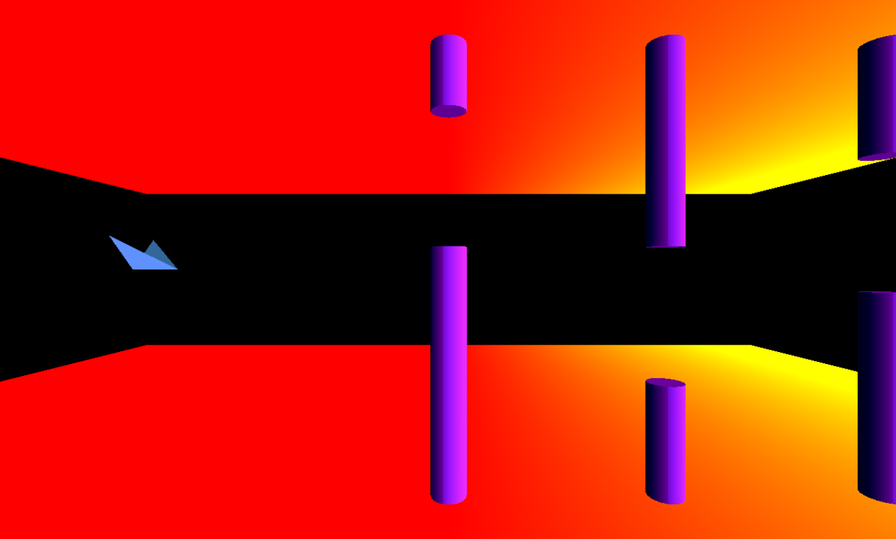

Trippy Bird
============
Minimalistic ripoff of Flappy Bird with 3D GL twist
Testing/playing with VBO possibilities in GLES 2

This sample uses the new [Gradle Experimental Android plugin](http://tools.android.com/tech-docs/new-build-system/gradle-experimental) with C++ support.

Pre-requisites
--------------
- Android Studio 1.3+ with [NDK](https://developer.android.com/ndk/) bundle.

Getting Started
---------------
1. [Download Android Studio](http://developer.android.com/sdk/index.html)
1. Launch Android Studio.
1. Open the sample directory.
1. Open *File/Project Structure...*
  - Click *Download* or *Select NDK location*.
1. Click *Tools/Android/Sync Project with Gradle Files*.
1. Click *Run/Run 'app'*.

Screenshots
-----------

